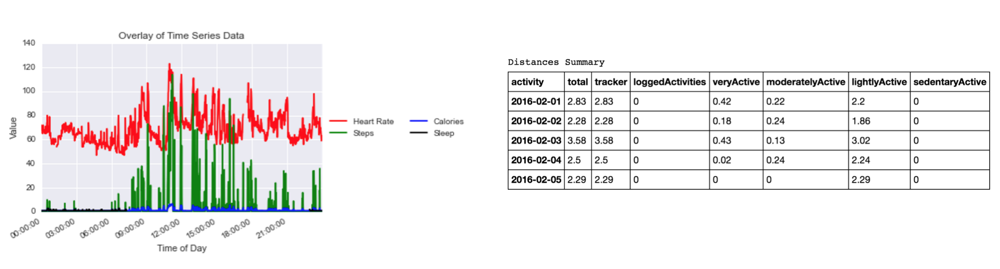

#Access and Save Your Fitbit Data

### Python scripts for accessing Fitbit’s API and downloading time-series and daily summary data.

##Requirements  
- Python 2.7+
- Fitbit Charge HR

##Installation

**Register your API:**  
[Follow this tutorial to obtain credentials](http://blog.mr-but-dr.xyz/en/programming/fitbit-python-heartrate-howto/)  
-This will give you your access and refresh tokens to access your data  
-This will have you download the “python-fitbit” library

**Install the Python requirements:**  
1. Clone this repository  
2. Start Terminal and go into the directory using `cd Fitbit`  
3. Install the requirements using `pip install -r requirements.txt`  

##Usage

**A. View/download data for one date (“1DayFitbit.ipynb”):**  
1. Drag the file “1DayFitbit.ipynb” into your “python-fitbit” folder  
2. In Terminal, go into the “python-fitbit” directory using `cd python-fitbit` and start a Jupyter Notebook by typing `jupyter notebook`  
3. Open “1DayFitbit.ipynb” and follow the instructions to collect and visualize your data  

**B. View/download data for a range of dates (“FitbitRange.ipynb”):**    
1.  Drag the file “FitbitRange.ipynb” into your “python-fitbit” folder  
2.  Start Terminal and enter the “python-fitbit” directory using `cd python-fitbit`  
3.  Create folders to store your data by running `mkdir -p Data/{Cals_Timeseries,Sleep_Summary,Sleep_Timeseries,Activities_Summary,Distances_Summary,HR_Summary,Steps_Timeseries,HR_Timeseries}`  
4.  Start a Jupyter Notebook by typing `jupyter notebook`  
5.  Open “FitbitRange.ipynb” and follow the instructions to collect your data  

**C. View/download 1-second interval heart rate data for a range of dates (“FitbitFullHR.ipynb”):**    
1.  Drag the file “FitbitFullHR.ipynb” into your “python-fitbit” folder  
2.  Start Terminal and enter the “python-fitbit” directory using `cd python-fitbit`  
3.  Create folders to store your data by running `mkdir -p Data/HR_Second_Timeseries`  
4.  Start a Jupyter Notebook by typing `jupyter notebook`  
5.  Open “FitbitFullHR.ipynb” and follow the instructions to collect your heart rate data  

